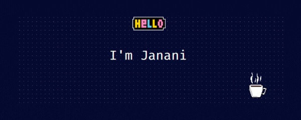

### About
Hello! I'm a frontend developer with 5+ years of experience building responsive and accessible web applications. I specialize in React, HTML, CSS, JavaScript and I'm passionate about creating beautiful and engaging user experiences.

- 😄 My Pronouns: **She/Her**

- 📍 Based near India

- 🌱 Currently, learning **Typescript**

- 👨‍💻 Checkout my projects [here](https://github.com/JiyaJanani?tab=repositories)

- 💬 Ask me about **Javascript** & **CSS** & **React** & **Redux**

- 🤝 Open for collaborations in web development 🕸️

- 📮 You can mail me at **jiyajananii@gmail.com**

	
### 💻 &nbsp;Skills

 
 

 
### 🛠 &nbsp;Tools

 
 

 

### ⚙️ &nbsp;GitHub Analyticš

### 🤝🏻 &nbsp;Connect with Me

  

  

   <!--  -->

